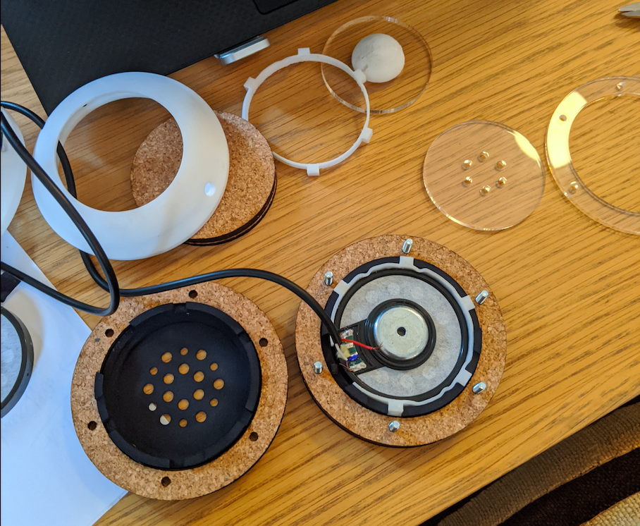

# HP.1

This repository contains the source code of HP.1, an attempt to build open-source headphones using Clojure & OpenSCAD.

## Philosophy

The main focus of HP.1 is to build headphones that are easy to assemble and repair, not costing its weight in gold, whislt also setting a high bar for their look & feel.

## Parts

Parts for HP.1 from this repository are manufacturable with 3D-printing and laser cutting.

Bought parts include speakers, screws & aluminium rods; the latest list is available [here](doc/iterations/alpha.1.md#parts).

## Running the project

Fire up a REPL and eval defpart statements, which will write to the three.scad file. Open it with OpenSCAD - any change will be live reloaded.

## Downloading parts

You can either run the projet and export parts as STL & SVG, or download the latest version built parts.