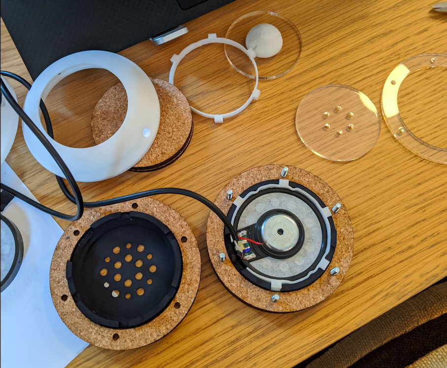

# HP.1-alpha.1

## Manufactured parts

- Speaker cup (SLS, nylon)
- Shell (SLS, nylon)
- Arc clip ball (FDM, TPU)
- Cork joint (laser, cork)
- Seethrough glass (laser, acrylic)

## Bought parts

- 2x Headphones drivers from diyearphoneslabs
- 6x 3x20mm flat top screws with bolts
- 2x Aluminium rods 520*4mm
- 1x 200mm Jack cable

## Learnings

Having only six main screws to hold everything together is a pleasure to work with and is validated for the next iteration.

The speaker cup and its cork joint work perfectly and are also validated for the next iteration.

The bolts are a bit tricky to handle when screwing. Next version should have a small notch to keep them in place.

The TPU printed parts were a downright catastrophe. As TPU is only available with FDM priting, the quality of this part is sub-par compared to the other SLS printed parts.

Overall, the worst part of this iteration is the arc clipping ball. It increases the assembly complexity because it cannot be rotated, so the glass has to be in the perfect position when gluing it. It is also difficult to force through the glass; TPU being flexible, is hard to make the interference fit work.

## Conclusion

Lot of interesting learnings that will be interesting to put to use in the next iteration. You should probably wait alpha.2 before building your HP.1 :wink: